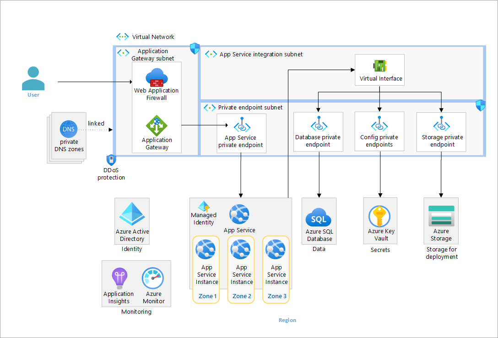

# App Services Baseline Architecture

This repository contains the Bicep code to deploy an Azure App Services baseline architecture with zonal redundancy.



## Deploy

The following are prerequisites.

## Prerequisites

1. Ensure you have an [Azure Account](https://azure.microsoft.com/free/)
1. Ensure you have the [Azure CLI installed](https://learn.microsoft.com/cli/azure/install-azure-cli)
1. Ensure you have the [az Bicep tools installed](https://learn.microsoft.com/azure/azure-resource-manager/bicep/install)

Use the following to deploy the infrastructure.

### Deploy the infrastructure

The following steps are required to deploy the infrastructure from the command line.

1. Update the infra-as-code/parameters file

  ```bash
    {
      "$schema": "https://schema.management.azure.com/schemas/2019-04-01/deploymentParameters.json#",
      "contentVersion": "1.0.0.0",
      "parameters": {
        "baseName": {
          "value": ""
        },
        "sqlAdministratorLogin": {
          "value": ""
        },
        "sqlAdministratorLoginPassword": {
          "value": ""
        }
      }
    }
  ```

1. In your command-line tool where you have the Azure CLI and Bicep installed, navigate to the root directory of this repository (AppServicesRI)
1. Run the following command to create a resource group and deploy the infrastructure. Make sure:

    * The location you choose [supports availability zones](https://learn.microsoft.com/azure/reliability/availability-zones-service-support) 
    * The BASE_NAME contains only lowercase letters and is between 6 and 12 characters. All resources will be named given this basename.
    * You choose a valid resource group name

    ```bash
    LOCATION=westus3
    BASE_NAME=<base-resource-name>
    RESOURCE_GROUP=<resource-group-name>
    az group create --location $LOCATION --resource-group $RESOURCE_GROUP

    az deployment group create --template-file ./infra-as-code/bicep/main.bicep \
      --resource-group $RESOURCE_GROUP \
      --parameters @./infra-as-code/bicep/parameters.json \
      --parameters baseName=$BASE_NAME
    ```

### Publish the web app

The baseline architecture uses [run from zip file in App Services](https://learn.microsoft.com/azure/app-service/deploy-run-package). There are many benefits of using this approach, including eliminating file lock conflicts when deploying.

To use run from zip, you do the following:

1. Create a [project zip package](https://learn.microsoft.com/azure/app-service/deploy-run-package#create-a-project-zip-package) which is a zip file of your project.
1. Upload that zip file to a location that is accessible to your web site. This implementation uses private endpoints to securely connect to the storage account. The web app has a managed identity that is authorized to access the blob.
1. Set the environment variable `WEBSITE_RUN_FROM_PACKAGE` to the URL of the zip file.

In a production environment, you would likely use a CI/CD pipeline to:

1. Build your application
1. Create the project zip package
1. Upload the zip file to your storage account

The CI/CD pipeline would likely use a [self-hosted agent](https://learn.microsoft.com/azure/devops/pipelines/agents/agents?view=azure-devops&tabs=browser#install) that is able to connect to the storage account through a private endpoint to upload the zip. We have not implemented that here.

**Workaround**

Because we have not implemented a CI/CD pipeline with a self-hosted agent, we need a workaround to upload the file to the storage account. There are two workaround steps you need to do in order to manually upload the zip file using the portal.

1. The deployed storage account does not allow public access, so you will need to temporarily allow access public access from your IP address.
1. You need to give your user permissions to upload a blob to the storage account.

Run the following to:

* Allow public access from your IP address, g
* Give the logged in user permissions to upload a blob
* Create the `deploy` container
* Upload the zip file `./website/SimpleWebApp/SimpleWebApp.zip` to the `deploy` container
* Tell the web app to restart

```bash
CLIENT_IP_ADDRESS=<your-ip-address>

STORAGE_ACCOUNT_PREFIX=stg
WEB_APP_PREFIX=app-
NAME_OF_WEST_STORAGE_ACCOUNT="$STORAGE_ACCOUNT_PREFIX$BASE_NAME"
NAME_OF_WEB_APP="$WEB_APP_PREFIX$BASE_NAME"
LOGGED_IN_USER_ID=$(az ad signed-in-user show --query id -o tsv)
RESOURCE_GROUP_ID=$(az group show --resource-group $RESOURCE_GROUP --query id -o tsv)
STORAGE_BLOB_DATA_CONTRIBUTOR=ba92f5b4-2d11-453d-a403-e96b0029c9fe

az storage account network-rule add -g $RESOURCE_GROUP --account-name "$STORAGE_ACCOUNT_PREFIX$BASE_NAME" --ip-address $CLIENT_IP_ADDRESS
az role assignment create --assignee-principal-type User --assignee-object-id $LOGGED_IN_USER_ID --role $STORAGE_BLOB_DATA_CONTRIBUTOR --scope $RESOURCE_GROUP_ID

az storage container create  \
  --account-name $NAME_OF_WEST_STORAGE_ACCOUNT \
  --auth-mode login \
  --name deploy

az storage blob upload -f ./website/SimpleWebApp/SimpleWebApp.zip \
  --account-name $NAME_OF_WEST_STORAGE_ACCOUNT \
  --auth-mode login \
  -c deploy -n SimpleWebApp.zip

az webapp restart --name $NAME_OF_WEB_APP --resource-group $RESOURCE_GROUP
```

Follow the [configure TLS guidance](docs/configure_tls.md) to enable TLS with App Gateway.